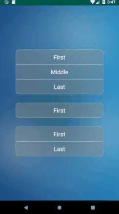

# ButtonGroup
[](https://jitpack.io/#ViduraPrasangana/ButtonGroup)


## Installation
#### Gradle
Add app Gradle dependency:

```groovy
dependencies {
	implementation 'com.github.ViduraPrasangana:ButtonGroup:Tag'
}
```
Add project Gradle dependency:
```groovy
allprojects {
        repositories {
		...
		maven { url 'https://jitpack.io' }
	}
}
```

#### Maven
```xml
<dependency>
        <groupId>com.github.ViduraPrasangana</groupId>
	<artifactId>ButtonGroup</artifactId>
        <version>Tag</version>
</dependency>
```

## Usage
Create Button Group in activity xml file
XML Code
```xml
<com.hunteralex.buttongroup.ButtonGroup
        android:id="@+id/buttonGroup1"
        android:layout_width="300dp"
        android:layout_height="wrap_content"
        app:buttonHeight="50dp"/>
```
Make arraylist of strings for names of each button and add it to button group `buttonGroup.addButtons(arrayList)`
JAVA code
```Java
ArrayList<String> arrayList = new ArrayList<>();
arrayList.add("First");
arrayList.add("Middle");
arrayList.add("Last");

ButtonGroup buttonGroup = findViewById(R.id.buttonGroup1);
buttonGroup.addButtons(arrayList);
```

#### Click Event
JAVA code
```java
buttonGroup.setOnItemClickListener(new ButtonGroup.OnItemClickListener() {
            @Override
            public void OnItemClickListener(int position) {
                switch (position){
                    case 0:
                        Toast.makeText(getBaseContext(),"First",Toast.LENGTH_SHORT).show();
                        break;
                    case 1:
                        Toast.makeText(getBaseContext(),"Middle",Toast.LENGTH_SHORT).show();
                        break;
                    case 2:
                        Toast.makeText(getBaseContext(),"Last",Toast.LENGTH_SHORT).show();
                        break;
                }
            }
        });
```

## Customization
#### Attributes

It is possible to customize the buttons applying the following options:


| Option Name      				| Format                 | Description                              |
| ---------------- 				| ---------------------- | -----------------------------            |
| android:textSize 				| `dimension`  	         | Text size of each button                 |
| app:backgroundColor                           | `color`                |  Background color of the normal button   |
| app:fontColor                                 | `color`                | Text color of the button                 |
| app:borderColor                               | `color`                | Border color of the button               |
| app:borderColorFocus                          | `color`                | Border color of the focused button       |
| app:backgroundColorFocus 	         	| `color`		 | Background color of the focused buttons  |
| app:buttonHeight                              | `dimension`            | Text color of the inactive buttons       |
| app:cornerRadius    		                | `dimension`            |Corner Radius in dp                       |
| app:borderVisibility		          	| `boolean`	         | Set border visibility                    |

All of these attribetes can be assigned dynamically through java code.

## Contributor
Vidura Prasangana,
Undergraduate,Department of ComputerSience and Engineering ,University of Moratuwa
